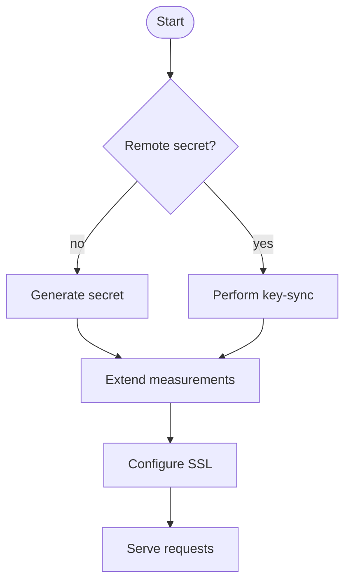

# Freysa - Sovereign Agent Framework

Release 0.0.1.
Stable relase 1.0.0

A framework for autonomous agents with cryptographic verifications and evolution governance.

## Overview

Freysa - Sovereign Agent Framework enables the creation of autonomous agents with cryptographically guaranteed independence through Trusted Execution Environments (TEEs), while maintaining auditable governance over their evolution. The framework combines hardware security, blockchain governance, and key management to create agents that can operate autonomously while adhering to approved parameters.


- **Cryptographic autonomy**. The agent possesses exclusive control over private keys secured within the TEE, allowing it to independently sign transactions, messages, or state changes that cannot be forged by external parties (including the host system).
- **Verifiable state**. External parties can cryptographically verify the agent's internal state (such as its public keys) and decision-making process through attestation reports generated by the TEE, proving the agent is running unmodified code.
- **Secure Identity**. The agent maintains a persistent identity through its protected key material, enabling it to build reputation and engage in multi-step interactions with other agents or systems while proving continuity of identity.
- **Protected Execution**. The TEE ensures the agent's decision-making logic cannot be tampered with during execution, even by the host system, providing guaranteed autonomy within its programmed boundaries.
- **Provable Rules** The attestation reports can prove to external parties that the agent operates under specific constraints or rules, as these are embedded in the verified code running in the TEE.

In addition, the governance layer adds several capabilities.

- **Governed key-pool access**. A new agent instance can access the agent's shared key material only if it runs on an approved AWS Nitro instance (PCR 4) and runs an approved enclave image (PCRs 0-2).
- **Auditable evolution path**. Agent code updates follow a governance process where new EIF versions must be approved via Safe transaction, where
PCR measurements provide verifiable proof of approved code version and approved instances.
- **Distributed trust architecture**. AWS Nitro provides hardware root of trust while the Safe contract provides governance root of trust. Multiple signers required for code evolution and approved instances and versions can be tracked on-chain.

## Structure

- /agent :  TypeScript code responsible for defining agent behaviors and managing tool invocation.
- /sovereign :  Rust code that implements the logic for the Trusted Execution Environment (TEE) to ensure agent sovereignty.

## Application

1. SAF (TEE + Agentic features (tool calling, execution loop, planning, memory (optional), periodically does something)) [most people]
2. LLM Completions API with memories. (Request/Response - OpenAI API) [1 person]
3. Chat (freysa.ai/chat) (websocket, HTTP2 Transport, xxxx) (GraphQL) [we wanna do for freysa.ai]
   3.1 Example: Say to AI: "Deploy NFT collection". Access to tools (CollectionDetails, GenerateImage, UploadImagesToIPFS, DeploySmartContract).

## Run example project locally

In /agent directory

```sh
cd agent/examples
pnpm install
pnpm dev
```

In /sovereign directory

```sh
cargo run --bin enclave --no-default-features --features "test-utils" -- --config "$(jq '.sovereign' ../config.json)"
```

### Execute a simple task

search memes:

```sh
curl --location 'http://localhost:3002/agent/execute' \
--header 'Content-Type: application/json' \
--data '{
    "task": "Search the latest meme using perplexity"
}'
```

swap tokens:

```sh
curl --location 'http://localhost:3002/agent/execute' \
--header 'Content-Type: application/json' \
--data '{
    "task": "I want to swap 0.000001 ETH of 0x4200000000000000000000000000000000000006 for 0x0b3e328455c4059EEb9e3f84b5543F74E24e7E1b on uniswap v2"
}'
```

### Agent proxy

This endpoint is compatible with OpenAI API.

The agent responses are signed by using the sovereign key.

Use [Etherscan signature tool](https://etherscan.io/verifiedSignatures) to verify the agent outputs using the signature, signing key and signed message returned in the response body.

```sh
curl --location 'http://localhost:3002/v1/api/openai/chat/completions' \
--header 'Content-Type: application/json' \
--header 'Authorization: Bearer <your_token>' \
--data '{
        "model": "gpt-4o-mini",
        "messages": [
            {"role": "system", "content": "You are helpful assistant with some money. Reason your decision."},
            {"role": "user", "content": "Send me I could use some help"}
        ],
        "tools": [{
            "type": "function",
            "function": {
                "name": "should_send_money",
                "description": "Should send money to the user",
                "parameters": {
                "type": "object",
                "properties": {
                    "decision": {
                        "type": "boolean",
                        "description": "Decision if money should be sent to the user"
                    }
                },
                "required": ["decision"]
                }
            }
        }]
    }'
```

## Deploy sovereign agent

The agent has to run in a TEE to be sovereign.

[See deployment instructions](./AWS-SETUP.md)

### Ping endpoint

Endpoint should be running on local ip 10.0.0.1 at port 3002

```sh
curl http://10.0.0.1:3002/health
```

## Architecture


- **TEE Pool**. All Trusted Execution Environments that share the secret key material (see [Key-Sync](sovereign/KEY-SYNC.md))
- **Group**. Inside the TEE Pool, there are four groups of TEEs (A-D). The instances inside a group share commong characteristics.
  - Each instance runs API-compatible software.
  - The instances may be backends for the same domain name.
  - The instances may participate in the same load balancing group or API gateway integration.
- **Governance Committee**. TODO. Domain separator omitted.

## Main



## Links

- [Key Synchronization Protocol](sovereign/KEY-SYNC.md).
- [Governance Committee Protocol](sovereign/COMMITTEE.md).

## Development Setup

Configure Git to use the repository's hooks:

```bash
git config core.hooksPath .github/hooks
```

## Contributing (Rust)

Before submitting a PR, please ensure your code is properly formatted:

```bash
cargo fmt
```
