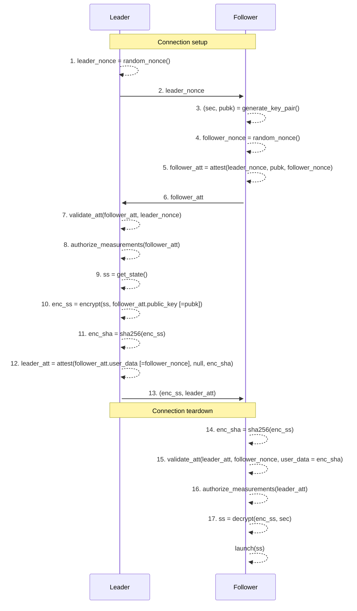

# Key synchronization protocol

This page describes a protocol for sharing private key material in a pool of Trusted Execution Environments (TEE).

In principle, it is possible to include different kinds of TEEs in the same pool.

- AWS Nitro Enclaves (fully supported)
- TDX enclaves (work in progress)
- Other types of enclaves may be supported in the future

For an existing enclave to share its secret key material with a new enclave that requests to join the pool, two properties must be fullfilled.

1. The software measurements of the new enclave must be authorized. For Nitro Enclaves, this means that PCRs 0-2 must be authorized.
2. The instance where the enclave runs must be authorized. For Nitro Enclaves, this means that PCR-4 must be authorized.

Below is a schematic diagram of a new TEE requesting to join a TEE Pool.

The authorization of measurements is managed by a separate protocol, viz., the [Governance Committee Protocol](COMMITTEE.md).

## Protocol description

The key-synchronization protocol has some similarity with a TLS (1.3) handshake (see, e.g., [Cloudflare's description](https://www.cloudflare.com/en-gb/learning/ssl/what-happens-in-a-tls-handshake/)). In this analogy, the Leader has the role of client and the Follower has the role of server; `leader_nonce` corresponds to "client random" and `follower_nonce` corresponds to "server random"; the attestation report `follower_att` roughly corresponds to the server certificate.

### Legend

- `attest(nonce, public_key, user_data)` - generate an attestation document containing `nonce`, `public_key`, and `user_data`.
- `validate_att(doc, nonce)` - validate that the attestation document `doc` is signed by the AWS root key and that it contains `nonce` in the nonce-field.
- `authorize_measurements(doc)` - ensure that the measurements of the attestation documents are authorized; for Nitro Enclaves this means that PCRs 0-2 is authorized code and PCR-4 is an authorized instance.
- `leader_nonce` - leader nonce, secure random.
- `sec` - follower secret key, secure random.
- `pubk` - follower public key corresponding to `sec`.
- `follower_nonce` - follower nonce, secure random.
- `follower_att` - follower attestation document containing `nonce = leader_nonce`, `public_key = pubk`, and `user_data = follower_nonce`.
- `ss` - the secret state of the leader, consisting of secret key material and configuration parameters.
- `enc_ss` - the secret state `ss` encrypted using `pubk`.
- `leader_att` - leader attestation document containing `nonce = follower_nonce, user_data = enc_ss`.

### Details

#### Protocol messages

The protocol exchange uses length prefixed messages over a TCP connection. Each message is prefixed by its length encoded as four bytes using big endian encoding.

#### Connection setup and teardown

Two ports of the key exchange are connected, e.g., by runing `socat VSOCK-CONNECT:$CID:4000 TCP-CONNECT:$REMOTE_CONFIG_IP:4001` on the EC2 host of the new enclave, where `CID` is the CID of the new enclave and `REMOTE_CONFIG_IP` is the IP address of the TEE to use as leader of the key synchronization protocol. Ideally, the `REMOTE_CONFIG_IP` is the IP address of the leader on a VPN and not a public IP. However, this is not required for the security of the protocol.

The connection is terminated as soon as both peers have read all bytes from their sockets and closed their connections.

#### Details of protocol steps

(1) The leader generates a 32 byte random nonce `leader_nonce` using a secure random number generator.

(2) The leader sends a message containing `leader_nonce` to the follower. The leader is now waiting for the attestation from the follower.

(3-4) Having received `leader_nonce` from the leader, the follower generates a secret key `sec` using secure randomness and derives the public key `pub` from the secret key. The follower then generates its own 32 byte nonce `follower_nonce` using secure randomness.

(5) The follower generates an attestation report using AWS Nitro Enclave functionality. This attestation report includes three fields that can be provided externally, viz., `nonce`, `public_key`, and `user_data`. These fields can be used to include any kind of data in the attestation report, but we try to use them for their intended purpose as far as possible. For example, the `nonce` field is provided by the attestation consumer as a proof of authenticity.

(6) The attestation report is sent from the follower to the leader. The follower is now waiting for the third and final message from the leader.

(7) The leader verifies that the attestation report is valid and contains the nonce `leader_nonce` provided in the first message. The verification includes verifying the certificate chain included in the attestation document with respect to the AWS root certificate. This ensures that the attestation report was generated by a valid AWS Nitro enclave and that it was generated after `leader_nonce` as generated. That is, the leader's nonce protects against replay attacks.

(8) This is the **critical step** for verifying that the follower is authorized to receive the secret key material of the key-synchronization pool. The details are described in a separate document [Governance Committee Protocol](COMMITTEE.md).

(9-12) Once the leader is satsified that it is interacting with an authorized enclave that follows the key-synchronization protocol, it retrieves its own secret state `ss` (9), encrypts it using the public key provided by the follower resulting in `enc_ss` (10), computes the hash `enc_sha` of the encrypted state `enc_ss` (11), and generates an attestation document `leader_att` containing the nonce `follower_nonce` provided by the follower in the previous interaction as well as the hash `enc_sha` of the secret state.

(13) The encrypted state `enc_ss` as well as the leader's attestation report `leader_att` are sent to the follower. The leader is now finished and closes its end of the socket. The follower may also close the socket as soon as the last message has been received.

(14-17) When the follower received the encrypted state `enc_ss` and the leader's attestation report `leader_att` from the leader, the follower computes the SHA-256 hash of `enc_ss` as `enc_sha`. Next it verifies that attestation report is valid with respect to the AWS certificate and that it contains `follower_nonce` (that the follower sent to the leader in the first interaction) in the `nonce` field and that it contains `enc_sha` in the `user_data` field. This ensures that the follower received the last message from a valid AWS Nitro Enclave and that `enc_ss` has not been tampered with. Next, it the follower authorizes the measurement of the leader's attestation document (analogous to how the leader authorized the follower's attestation document); this makes sure that the leader is a member of the TEE pool. It then decrypts `enc_ss` using its ephemeral secret key `sec` revealing the secret state `ss` of the key-synchronization pool that the leader participates in.

This completes the key-synchronization protocol. The follower is now ready to launch.
